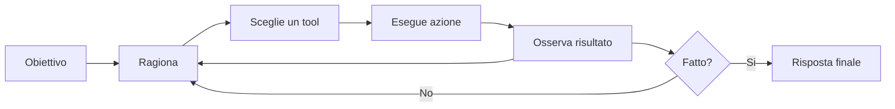
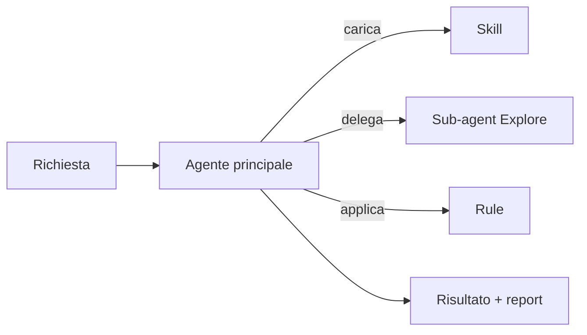
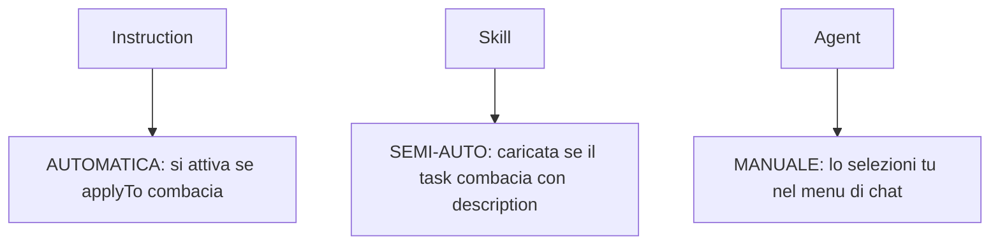
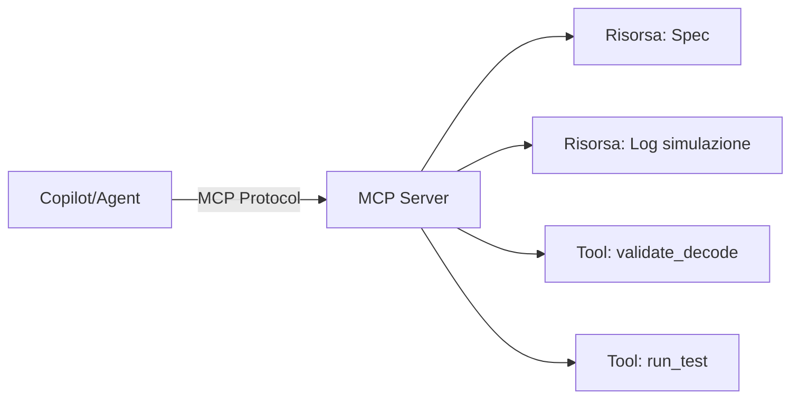

# Produttività con gli LLM in VS Code
### Guida pratica per sviluppatori RTL/ASIC — Giugno 2026

> Una presentazione semplice su rule, skill, agent e tutti gli strumenti
> che rendono il lavoro con un assistente AI più veloce, coerente e sicuro.

---

## Indice

1. I 4 concetti fondamentali
2. Rule (Instructions)
3. Skill
4. Agent
5. Agent Flow (orchestrazione)
6. Dove vivono i file e come si attivano
7. Strumenti extra per la produttività
8. Le API di Copilot
9. Model Context Protocol (MCP)
10. Memoria persistente
11. Guardrail e sicurezza
12. Checklist pratica per il tuo progetto RISC-V

---

## 1. I 4 concetti fondamentali

Pensa all'assistente AI come a un collega esperto. Per renderlo davvero utile
devi dirgli **come** comportarsi, **cosa** sapere e **cosa** può fare.

| Concetto | In una frase | Metafora |
|----------|--------------|----------|
| **Rule** | Una regola sempre valida | Il regolamento aziendale |
| **Skill** | Conoscenza caricata quando serve | Il manuale giusto aperto sulla pagina giusta |
| **Agent** | Un assistente che agisce, non solo parla | Un collega con le chiavi del laboratorio |
| **Agent Flow** | Più agenti che collaborano | Un team con ruoli diversi |

---

## 2. Rule (Instructions)

**Cos'è:** un'istruzione persistente in linguaggio naturale che condiziona
sempre il comportamento del modello, senza doverla ripetere.

**Caratteristiche:**
- Si attiva **da sola** quando il file combacia con il pattern `applyTo`.
- Vive nel repo, è versionata in git, condivisa col team.
- Definisce convenzioni e divieti ("commenti in inglese", "vietati i latch impliciti").

**Esempio (estratto):**
```yaml
---
description: "Convenzioni RTL SystemVerilog per il core RISC-V."
applyTo: "source/sv/rtl/**/*.sv"
---
- I commenti nel codice RTL devono essere in inglese.
- Vieta i latch impliciti: default in ogni ramo always_comb.
```

> Da ricordare: la rule **non** rende il modello più bravo, lo rende più **coerente**.

---

## 3. Skill

**Cos'è:** un blocco di conoscenza di dominio caricato **su richiesta**,
solo quando il task rientra nel suo ambito.

**Differenza chiave con la rule:**
- La rule è **sempre attiva**; la skill è **dormiente** finché non serve.
- Il campo `description` ("USA QUANDO...") è il **trigger** che decide il caricamento.

**Cosa la rende efficace:**
- ❌ Debole: "Sei un esperto di RISC-V" (solo un'etichetta, effetto minimo).
- ✅ Forte: tabella di decode reale, procedure passo-passo, link alla spec ufficiale.

> Una skill non aumenta l'intelligenza del modello: ne aumenta
> **l'aderenza ai fatti del tuo progetto** e riduce le allucinazioni.

---

## 4. Agent

**Cos'è:** un LLM messo in un **loop** con accesso a **strumenti** (tool).
Non risponde soltanto: legge file, cerca nel codice, esegue comandi e decide
il passo successivo in base ai risultati.

**Il ciclo (ReAct = Reasoning + Acting):**



**Esempio:** un agente di review RTL read-only con `tools: ["search", "codebase", "usages"]`
→ può analizzare ma **non** modificare i file.

Mostrare l'esempio dell'agente per l'sdc e specificare che per creare sia un agente che un prompt bisogna mettere l'md in prompt.Fai anche vedere che puoi farti un agente locale
---

## 5. Agent Flow (orchestrazione)

**Cos'è:** la coordinazione di **più agenti o passi specializzati** per
risolvere un compito complesso. Non è un singolo file: è **come li combini**.

**Pattern più comuni:**

| Pattern | Come funziona | Quando usarlo |
|---------|---------------|---------------|
| Orchestrator–worker | Un coordinatore delega a sub-agent | Task complessi e scomponibili |
| Sequential / pipeline | Output di uno → input del successivo | Fasi in sequenza |
| Routing | Un agente classifica e instrada | Richieste eterogenee |
| Evaluator–optimizer | Uno produce, uno valuta in loop | Qualità iterativa |



---

## 6. Dove vivono i file e come si attivano

**Posizione standard (versionata in git):**

| Tipo | Cartella | Estensione |
|------|----------|------------|
| Instructions | `.github/instructions/` | `*.instructions.md` |
| Instructions globali | `.github/copilot-instructions.md` | file singolo |
| Skills | `.github/skills/<nome>/` | `SKILL.md` |
| Agents | `.github/agents/` | `*.agent.md` |
| Prompt files | `.github/prompts/` | `*.prompt.md` |

**Come si attivano — la differenza cruciale:**



> Tutti richiedono **frontmatter YAML** tra `---` per essere riconosciuti.

---

## 7. Strumenti extra per la produttività

**a) Prompt files (`.prompt.md`)**
Prompt complessi, isolati, versionabili e riutilizzabili (es. "genera testbench").

**b) Routing / dispatcher**
Un agente che smista il compito al tool o agente giusto.

**c) Context windowing**
Skill piccole e focali → meno token, più precisione. Meglio 4 micro-skill
(ALU, decode, memory, interrupt) che una gigante.

**d) Iterative refinement**
Loop generate → evaluate → refine con un agente di review dedicato.

**e) Parallel execution**
Più agenti lavorano in parallelo, poi si fa il merge dei risultati.

**f) Success criteria espliciti**
Definire nell'agent cosa significa "fatto bene" (compila? zero latch? spec allineata?).

---

## 8. Le API di Copilot

Finora abbiamo *configurato* l'assistente con file. Le **API** ti permettono
invece di **programmarlo**: integrare i modelli di Copilot dentro tue estensioni,
script o strumenti interni. È il passo da "utente" a "costruttore".

**I tre livelli principali:**

| Livello | A cosa serve | Tecnologia |
|---------|--------------|------------|
| **Language Model API** | Inviare prompt ai modelli di Copilot da una estensione VS Code | `vscode.lm` |
| **Chat & Tools API** | Creare partecipanti `@nome` e tool che il modello può invocare | `vscode.chat`, `vscode.lm.registerTool` |
| **Copilot Extensions / REST** | Agenti accessibili su GitHub e chiamate via REST | GitHub App + Models REST API |

**Esempio minimo (Language Model API in una estensione VS Code):**
```ts
// Seleziona un modello Copilot disponibile
const [model] = await vscode.lm.selectChatModels({ vendor: 'copilot' });

// Invia una richiesta e leggi la risposta in streaming
const messages = [vscode.LanguageModelChatMessage.User('Spiega questo encoding RV32I')];
const response = await model.sendRequest(messages, {}, token);
for await (const chunk of response.text) {
  console.log(chunk);
}
```

**Quando usarle nel tuo contesto ASIC:**
- Automatizzare check ricorrenti (es. uno script che valida le tabelle di decode).
- Integrare l'AI in tool interni di flow (lint RTL, generazione report).
- Esporre un agente custom riusabile dal team via `@mention`.

> Regola pratica: usa i **file di configurazione** per il lavoro quotidiano
> in chat; passa alle **API** quando vuoi automazione programmatica o integrare
> Copilot in pipeline e strumenti esistenti.

---

## 9. Model Context Protocol (MCP)

**Cos'è:** uno standard aperto (Anthropic) che connette gli LLM a risorse esterne
e tool in modo standardizzato. È il "ponte" tra Copilot e i tuoi sistemi reali.

**L'idea centrale:** invece che l'LLM sia isolato e usi solo il training data,
MCP gli permette di accedere **live** a:
- Dati in tempo reale (spec attuali, risultati di simulazione, stato della build).
- Tool specializzati (valida encoding, esegui test, verifica latch).
- Risorse esterne (database, API interne, repository).

Tutto attraverso un **protocollo standard (JSON-RPC)**, quindi funziona ovunque.



**Tre tipi di risorsa MCP:**

| Tipo | Cosa fa | Esempio nel tuo core |
|------|---------|---------------------|
| **Resources** | Rende dati leggibili | `RISCV_Processor_Spec_v1.md` come dato strutturato |
| **Tools** | Funzioni che il modello invoca | `validate_decode(instr, opcode, funct3)` → risposta + feedback |
| **Prompts** | Template con contesto dinamico | "Aggiungi istruzione {nome}" → carica spec live e controlla |

**Vantaggi nel tuo contesto RISC-V:**

✅ **Context sempre allineato:** non copia statica di spec, ma dati live.
✅ **Errori ridotti:** Copilot chiama `validate_decode()` anziché indovinare.
✅ **Automazione:** script che valida decode, esegue sim, verifica latch — tutto invocabile.
✅ **Team-ready:** MCP server + VS Code = tutti usano i medesimi tool.

**Come funziona in VS Code:**

Configuri un MCP server in `.vscode/settings.json` o in un config file dedicato:
```json
{
  "mcpServers": {
    "riscv-validator": {
      "command": "python",
      "args": ["/path/to/.github/mcp/riscv_mcp_server.py"]
    }
  }
}
```

Copilot scopre automaticamente i tool e le risorse, e puoi usarli in chat o negli agent.

**Casi d'uso pratici:**

1. **Validator server** → `validate_decode(instr_name, opcode, funct3, funct7)` controlla contro spec live.
2. **Simulation server** → `run_test(name)` esegue un test e restituisce risultati `.vcd`.
3. **Spec query** → `get_instruction(name)` ritorna encoding, bit field, immediati validi.
4. **Linter server** → `check_latch(file.sv)` scansiona il file e riporta latch impliciti.

**Il valore aggiunto rispetto a quello che hai già:**

| Cosa abbiamo | Limite | MCP risolve |
|---|---|---|
| Rules + Skills | Dati statici, sincronizzazione manuale | Dati live, sempre aggiornati |
| Agent | Tool definiti nel file `.agent.md` | Tool in server, riutilizzabili ovunque |
| API Copilot | Programmazione manuale | MCP standardizza l'integrazione |

> MCP è il livello di **integrazione profonda**: quando vuoi che Copilot sia
> veramente parte del tuo workflow (non solo chat), MCP è lo strumento.

**File creati in questo progetto:**
- `.github/mcp/riscv_mcp_server.py` → Server MCP con tool di validazione RV32I.
- `.github/mcp/MCP_SETUP.md` → Guide step-by-step per l'integrazione.
- `.vscode/settings.json` → Configurazione VS Code pre-compilata.

Per iniziare: leggi `.github/mcp/MCP_SETUP.md` e segui i passi.

---

## 10. Memoria persistente

Tre livelli di memoria che l'assistente può consultare da solo:

| Livello | Cosa conserva | Durata |
|---------|---------------|--------|
| **User** | Preferenze valide ovunque (es. "commenti RTL in inglese") | Sempre |
| **Session** | Contesto del task corrente, piano di lavoro | Solo questa conversazione |
| **Repo** | Fatti su questo progetto (come compilare, dov'è la spec) | Legata al repo |

> Esempio utile: documenta una volta la procedura "aggiungi istruzione RV32I"
> in repo memory, e non dovrai mai più rispiegarla.

---

## 11. Guardrail e sicurezza

Combinando i vari strumenti crei **barriere a più strati**:

- **Tool restriction**: agenti read-only per la review (niente modifiche accidentali).
- **Write-limited**: modifiche permesse solo in certe cartelle.
- **No-terminal**: vietato eseguire comandi shell (solo analisi statica).
- **Rule come vincolo**: "vieta i latch", "non introdurre dipendenze fuori dal flow Cadence".

> La sicurezza non è un singolo interruttore: è la **somma** di rule + tool
> ristretti + criteri di successo espliciti.

---

## 12. Checklist pratica per il progetto RISC-V

**Da fare subito:**
- [ ] Una rule RTL su `source/sv/rtl/**/*.sv` (già fatta ✅)
- [ ] Skill focali invece di una sola gigante (decode, ALU, memory...)
- [ ] Un agente di review read-only (già fatto ✅)
- [ ] Repo memory con la procedura "aggiungi istruzione RV32I"
- [ ] Blocco "success criteria" nell'agente di review

**Quando usare cosa:**
- Azione occasionale → **inline chat**
- Comportamento ricorrente e identico → **agent / rule / skill**

---

## In una frase

> **Rule** = come comportarsi · **Skill** = cosa sapere · **Agent** = cosa fare ·
> **Agent Flow** = come collaborare.
>
> Insieme trasformano i tuoi prompt migliori in strumenti permanenti,
> sicuri e riutilizzabili.

---

### Fonti per approfondire
- Anthropic — "Building Effective Agents"
- OpenAI — "A Practical Guide to Building Agents"
- Paper "ReAct: Synergizing Reasoning and Acting in Language Models" (arXiv:2210.03629)
- Documentazione ufficiale VS Code Copilot (custom instructions, skills, agent mode)
